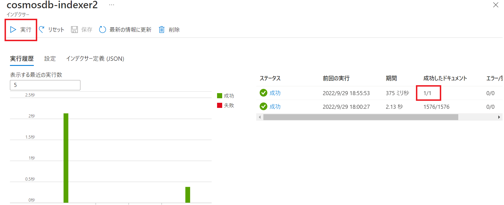
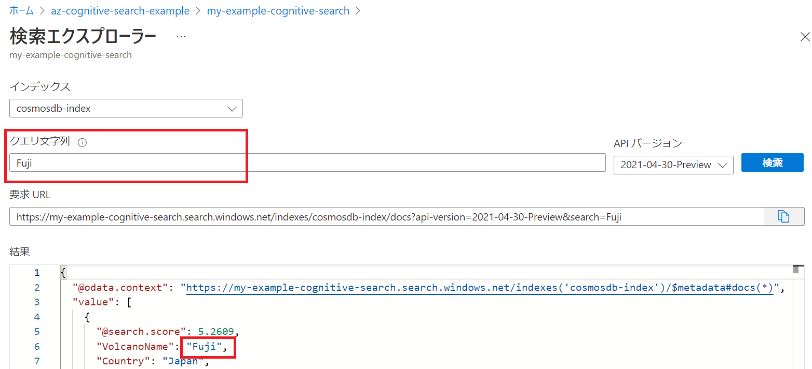

# Azure Cognitive Search

全文検索？
cosmos dbと相性が良さそう
利用方法について簡単にまとめる

Cosmos DB を作成し、データを投入、Cognitive Searchで検索してみる

## Cosmos DB Account と DB作成 (SQL API)
```
az group create -n az-cognitive-search-example -l japaneast
#az group delete -n az-cognitive-search-example

# Create a Cosmos account (SQL API)
az cosmosdb create --name my-example01account --resource-group az-cognitive-search-example

# Create a DB
az cosmosdb sql database create -a my-example01account -g az-cognitive-search-example -n my-db1

# Create a Container
az cosmosdb sql container create -a my-example01account -g az-cognitive-search-example -d my-db1 -n example-cont1 -p /id --throughput 400
```

## テスト用のデータ
https://github.com/Azure-Samples/azure-cosmos-db-sample-data
VolcanoData.json (世界の火山のデータ 1571件)

以下は富士山のデータの例
```
  {
    "Volcano Name": "Fuji",
    "Country": "Japan",
    "Region": "Honshu-Japan",
    "Location": {
      "type": "Point",
      "coordinates": [
        138.73,
        35.35
      ]
    },
    "Elevation": 3776,
    "Type": "Stratovolcano",
    "Status": "Historical",
    "Last Known Eruption": "Last known eruption from 1700-1799, inclusive",
    "id": "8b4c7cdd-a6c1-2398-494e-98755176dd57"
  },
```

※"Volcano Name" 空白が入っていると Cognitive Service の index の対象から外れてしまうようなので空白を取り除く。

### データエクスプローラー(SQL APIで)検索してみる

日本の火山
```
SELECT * FROM c where c.Country = "Japan"
```

富士山 (※フィールド名に空白を含んでいる場合)
```
SELECT * FROM c where c["Volcano Name"] = "Fuji"
```

件数(全体)
```
SELECT COUNT(1) FROM c
```

※全件削除はコンテナを作り直す

## これも使える？
https://github.com/Azure-Samples/azure-search-sample-data

## Cognitive Service (sku=Free or Basic)の作成
```
az search service create --name my-example-cognitive-search --resource-group az-cognitive-search-example --sku Free --partition-count 1 --replica-count 1 --identity-type SystemAssigned
```
※システム割り当てマネージド ID を使用


### Cosmos DBと連携 (インデックスの作成・再作成)

CosmosDBにデータが入っている状態でIndexを作成する

https://learn.microsoft.com/ja-jp/azure/search/search-howto-index-cosmosdb

データを新たに登録した場合は インデクサー を実行することで再作成が可能。

※上の例では差分の１件が作成されている

###　検索してみる (Search エクスプローラー利用)

クエリ文字列(Lucene ベースのクエリ言語) に条件を指定して検索することができます。



クエリ文字列の例
( ※search=*　は 上位 50 のドキュメント )

件数指定
```
$top=3
```

フィールド検索
```
fieldName:searchExpression
"VolcanoName":Fuji
```

###　検索してみる (REST API) ※curlを利用
```
curl "https://my-example-cognitive-search.search.windows.net/indexes/cosmosdb-index/docs?api-version=2021-04-30-Preview&search='VolcanoName':Fuji" -H "api-key: xxx...xxx "
```
